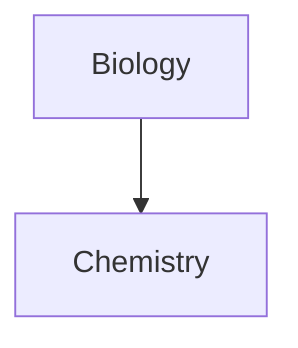
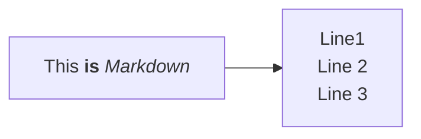
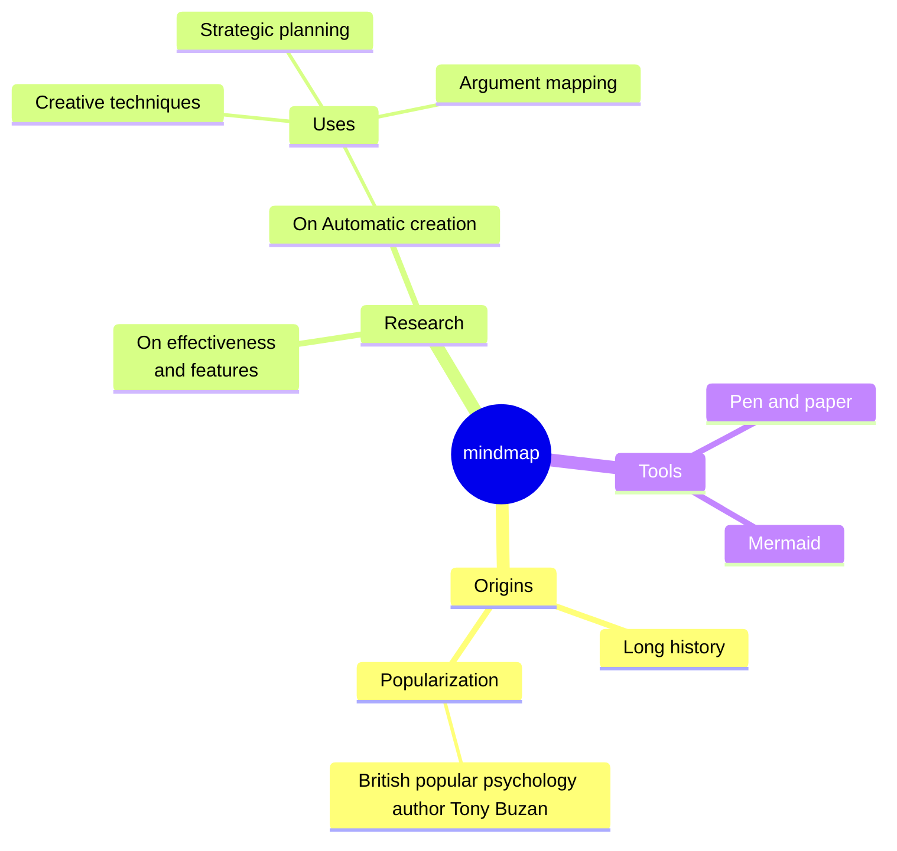

---
tags:
 - activity/log
 - people/pal
 - year/2024
 - recurring/daily
---
#### Pal Life Notes

Command + P opens up Command panel 
Command + O opens up quick switcher i.e. files to be opened 
Command + option + b to open backlinks (need to configure)

**Utilities**
Calendar plugin 

**Content type** 
Excalidraw plugin for live demos and collaboration
mermaid diagram for representation in md format 

**Content representation**
Home page https://www.youtube.com/watch?v=AatZl1Z_n-g&list=PL7oLu8NfQd84_gsyqBVSVgUmCCgcvSZMx&index=21&ab_channel=FromSergio covers the custom css, home plugin, data js 
Dataview plugin to query and list frontmatter 
Notion db Database folder plugin to add frontmatter 
Review flashcard plugin 
Mindmap plugin
Tracker plugin to track weight, meditation and so on 

**Content edit**
HoverEdit plugin: Edit over an internal link
Autocomplete plugin 
Advanced toolbar plugin

**Content automator** 
Template core plugin 
templater custom plugin 
Plugin periodic notes easy to jump across multiple notes (hotkeys): need to configure 
Quickadd plugin to run macros to download movie content from imdb 
Booksearch plugin to download book from google books 
Podnotes to listen to podcasts 
Readwise to download content from articles 

Learnt about mermaid flowchart. Too powerful. 

-----------
#### Pal Journaling notes 

------

#### Pal Tech Notes

------ 
#### Pal Work Notes
Presentation
- Signalscience by fastly
- Anomalies patterns
	- Application headers
	- log4j pattern
	- Rate-limiting
	- Run as a module in HAProxy 
	- Signalscience will introduce latency 
- Lacework, Grafana, Signalscience contribute to HAProxy workload
- CloudArmor
- Where is signalscience added ? web, api
- Device, semi-integrated traffic not inspected 
- Traceable was also looked upon
- Google chronicle is used the dashboard
- TLS termination??? Not done by SecurityScience as of today
- metric injected into chronicle? grafana? metrics are moved to GCS bucket
- legacy network balancer
- CloudArmour
	- Expensive
	- Newer ALBs dont support legacy TLS 
- HAProxy to look sticktables to decide on whether to send the request to 

Identify the things to do
- when to do it?
- what are the side effects?

Signals 
5xx
- What's broken?
- What's percentage?
- One node vs all nodes?
- What is the impact?
- Is it isolated?
- which nodes?
- How often?
	- 3 or 4 dashboard
- IM interrupting 
- COS-on-call?
	- Can solve it
	- Escalate to senior
	- Escalate to IM 
- What's the impact?
- 

