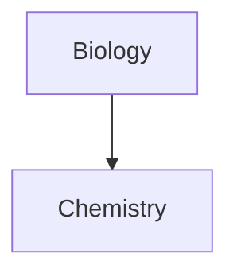
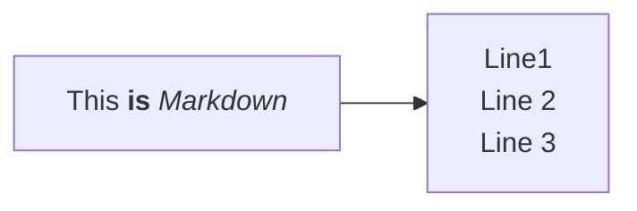
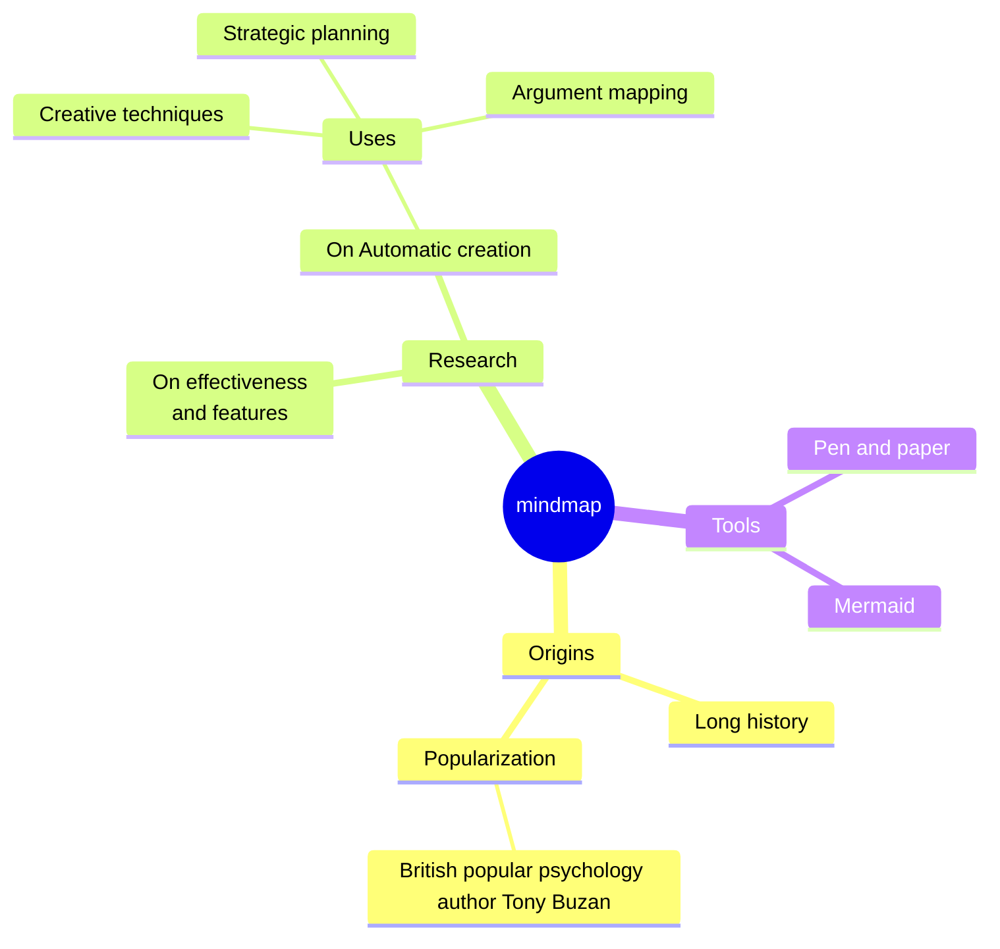

---
tags:
 - nexus/note_log
 - people/pal
 - date/2024-03-11
 - nexus/journal_daily
---
#### Pal Life Notes

Learnt about mermaid flowchart. Too powerful. 

-----------
#### Pal Journaling notes 

------

#### Pal Tech Notes

------ 
#### Pal Work Notes
Presentation
- Signalscience by fastly
- Anomalies patterns
	- Application headers
	- log4j pattern
	- Rate-limiting
	- Run as a module in HAProxy 
	- Signalscience will introduce latency 
- Lacework, Grafana, Signalscience contribute to HAProxy workload
- CloudArmor
- Where is signalscience added ? web, api
- Device, semi-integrated traffic not inspected 
- Traceable was also looked upon
- Google chronicle is used the dashboard
- TLS termination??? Not done by SecurityScience as of today
- metric injected into chronicle? grafana? metrics are moved to GCS bucket
- legacy network balancer
- CloudArmour
	- Expensive
	- Newer ALBs dont support legacy TLS 
- HAProxy to look sticktables to decide on whether to send the request to 

Identify the things to do
- when to do it?
- what are the side effects?

Signals 
5xx
- What's broken?
- What's percentage?
- One node vs all nodes?
- What is the impact?
- Is it isolated?
- which nodes?
- How often?
	- 3 or 4 dashboard
- IM interrupting 
- COS-on-call?
	- Can solve it
	- Escalate to senior
	- Escalate to IM 
- What's the impact?
- 

