tags:
  - area/pal_employee_monolithobservability
  - date/2024-03-14
priority: P1
assignedTo: people/pal
work: analysis
---

Needs to be documented in [[Incident Management]]
[[Grafana queries]]


--------
## Alert Investigation 

- [ ] Alert occurred 
- [ ] Page primary COS on-call 
- [ ] Start a discussion in #monolith-alerts-discussion 
	- [ ] Click on emoji `monolith-error` to forward messages from other channel to #monolith-alerts-discussion channel 
- [ ] [Pre-impact analysis](#pre-impact-analysis)
- [ ] Is it production issue? 
	- [ ] Yes: impact understood? 
		- [ ] High: [Declare the incident](#declare-the-incident) and continue investigation
		- [ ] Low: Continue investigation 
		- [ ] No: Page secondary COS on-call 
- [ ] Symptom identified? 
	- [ ] Yes: Know a way to mitigate the problem? 
		- [ ] Yes: Problem mitigated 
		- [ ] No: Page secondary COS on-call 
	- [ ] No: Page secondary COS on-call 
- [ ] Problem identified? 
	- [ ] Yes: Know a way to fix the problem?  
		- [ ] Yes: Problem Fixed
		- [ ] No: Page secondary COS on-call 
	- [ ] No: Page secondary COS on-call 
- [ ] Post-analyze the problem 

## Pre-impact analysis 

### Determine the timeline 
- [ ] From the alert triggered, determine the start time of the incident 
- [ ] incident ended, determine the end time too. 
### Know the active region 
- [ ] 

## Impact Analysis 

### Metric analysis 
- [ ] Analyze the following metrics 
	- [ ] Response time metric i.e. latency 
	- [ ] Error rate metric 
	- [ ] Traffic drop metric 
	- [ ] Availability metric 
- [ ] Identified impact?
	- [ ] High: 
	- [ ] Low: Continue investigation with declaring incident 

### One vs multiple nodes 
- [ ] Check for one or multiple nodes 
	- [ ] Multiple node --> High 
	- [ ] One node --> Low 
- [ ] Identified impact? 
	- [ ] High: Move to verifying whether it is is one or multiple groups 
	- [ ] Low: Continue investigation without declaring incident 

### One vs multiple groups
- [ ] Impact groups? 
	- [ ] COSDevice: Device users are impacted -->  High
	- [ ] COSAPI: Webdashboard, Third-party developers, Microservice are impacted  --> High 
	- [ ] COSPayment: Payment non critical traffic are impacted --> High 
	- [ ] SupportServer: ??
	- [ ] COSBatch: Quartz job are impacted --> Low 
	- [ ] COSBoarding: Boarding traffic impacted --> Low 
	- [ ] COSAPK: APK traffic impacted --> Low 
- [ ] Identified impact? 
	- [ ] High: [Declare the incident](#declare-the-incident)
	- [ ] Low: Continue investigation without declaring incident 


## Declare the incident 

- [ ] Page Incident on-call manager 
- [ ]  Incident on-call manager 
	- [ ] Create INC JIRA ticket 
	- [ ] Create a public slack channel for noting down events and communication 
	- [ ] Create a google meet for mitigation efforts 
	- [ ] COS on-call joins the google meet 
- [ ] COS on-call 
	- [ ] Create a private slack channel to discuss the symptoms and fixes 
	- [ ] Let the leadership know about the channel to add engineers. 
	- [ ] Identify the symptom to come up with a mitigation plan 

## Identify the problem and mitigation based on the symptom 

### HAProxy
#### HAProxy load shedding
- [ ] Identify the problem
	- [ ] HAProxy backend sessions touched the maximum connection (maxconn) limit (NA cosdevice limit: 60K) [Grafana](https://clovernetwork.grafana.net/d/a3fa960a-837a-4440-8b9b-05a44e3af8cc/haproxy-platform?orgId=1&viewPanel=87)
	- [ ] Indicates the backend application is degraded in processing capability
	- [ ] HAProxy backend session queue would be filled up. All these requests would soon time-out returning 5xx to clients [Grafana](https://clovernetwork.grafana.net/d/a3fa960a-837a-4440-8b9b-05a44e3af8cc/haproxy-platform?orgId=1&viewPanel=4)
	- [ ] HAProxy queue time would have increased. This indicates request have been held in a queue for certain seconds. Ideally should be close to zero [Grafana](https://clovernetwork.grafana.net/d/a3fa960a-837a-4440-8b9b-05a44e3af8cc/haproxy-platform?orgId=1&viewPanel=90)
- [ ] Potential causes 
	- [ ] [High 5xx error](#high-5xx-error)
	- [ ] [Increase in traffic](#increase-in-traffic)

#### Increase in traffic
- [ ] Increase in traffic [Grafana](https://clovernetwork.grafana.net/d/a3fa960a-837a-4440-8b9b-05a44e3af8cc/haproxy-platform?viewPanel=panel-88)
	- [ ] Spiky increase in traffic 
		- [ ] Could be DDoS ? Page Security on-call 
	- [ ]  Gradual increase in traffic 
		- [ ] Page SRE-on-call 
- [ ] Disaster Recovery cutover? 
	- [ ] Can be ignored as traffic increases when a passive region becomes active 

### COS application 

#### COS errors 
- [ ] Identify the problem
	- [ ] [Database table missing](#database-table-missing) 
	- [ ] [Downstream service or platform not responding](#downstream-service-or-platform-not-responding)
- [ ] Mitigation options 
	- [ ] Errors not impacting users 
		- [ ] Impact certain processing, change log level to WARN 
		- [ ] Only for informational purposes, change log level to INFO 
	- [ ] Errors impacting users - Identify the specific root cause 

#### COS node restarted
#### COS node out of rotation
- [ ] Identify the problem
	- [ ] COS nodes would be taken out of rotation due to health checks failing in HAProxy. 
	- [ ] HAProxy marking a node as not being available [Grafana](https://clovernetwork.grafana.net/d/a3fa960a-837a-4440-8b9b-05a44e3af8cc/haproxy-platform?orgId=1&viewPanel=53)
	- [ ] COS health check endpoint might have high latency [Grafana](https://clovernetwork.grafana.net/d/NNFA_2JVz/cos-monitoring?orgId=1&viewPanel=87)
	- [ ] Which nodes are taken out of rotation? [NA device SLB](http://slbdevice01.prod.iad04.clover.network:9876/#client_devices)
- [ ] Potential causes  
	- [ ] [Code deployment in-progress](#cos-code-deployment-inprogress)
	- [ ] [High memory](#cos-high-memory)
	- [ ] [Manually taken out of rotation]() --> Page SRE-on-call 
	- [ ] Meta primary not serving traffic ?
	- [ ] Order primaries not serving traffic ? 

#### COS code deployment issues 
- [ ] Identify the problem
	- [ ] Ensure release is happening 
	- [ ] Ensure the node deployments have completed [Grafana][https://grafana.corp.clover.com/d/xKr00vgVz/na-prod-release-status?orgId=1&search=open&folder=current] 
	- [ ] Continue investigation if the alert did not resolve 
- [ ] 

#### COS High CPU 
- [ ] Mitigation options 
	- [ ] [Increase application resources](#increase-application-resources) 

#### COS High memory 
- [ ] Identify the problem 
	- [ ] High JVM memory utilization in percentage [Grafana](https://clovernetwork.grafana.net/d/NNFA_2JVz/cos-monitoring?orgId=1&viewPanel=130)
	- [ ] Manual GC triggered [Grafana](https://clovernetwork.grafana.net/d/NNFA_2JVz/cos-monitoring?orgId=1&viewPanel=99)
		- [ ] Better to disable manual GC trigger as it hides the memory problem and also has not helped a lot in reducing the memory [How?](https://github.corp.clover.com/clover/puppet/pull/9072)
	- [ ] Take a heap dump using rundeck job to identify the problem 
		- [ ] rundeck failure --> Page SRE on call 
- [ ] Mitigation options
	- [ ] [Increase jvm memory]()
- [ ] Probable causes 
	- [ ] [Database high number of rows examined](#database-high-number-of-rows-examined)
- [ ] 

#### COS high thread 
- [ ] Identify the problem 
	- [ ] Take a thread dump using rundeck job  
	- [ ] Thread not revealing anything 
		- [ ] Enable thread dumps
- [ ] Mitigation options
	- [ ] [Disable server feature](#block-the-feature-behind-the-server-feature-flag) for non-critical features 
	- [ ] [Puppet config change]() to limit thread pool size
	- [ ] [Rolling restart the nodes]()
- [ ] Potential causes  
	- [ ] Instantiating thread creation classes in method invocation rather than as a singleton 
- [ ] Short-term fixes 
	- [ ] Load shed tasks by having a bounded queue 

#### COS threads dying 
- [ ] Potential causes  
	- [ ] Due to exception 
- [ ] Short-term fixes 
	- [ ] Add exception blocks to catch failures that would lead to thread termination 


#### COS High disk 
- [ ] 

#### COS drop in 2xx requests 
- [ ] Identify the problem
	- [ ] HAProxy should show the degradation i.e. drop in 2xx [Grafana](https://clovernetwork.grafana.net/d/a3fa960a-837a-4440-8b9b-05a44e3af8cc/haproxy-platform?orgId=1&viewPanel=88)
	- [ ] Application reporting 2xx count [Grafana]() [Datadog Cosdevice]() [Datadog cosapi]() [Datadog cosbatch]()
- [ ] Potential causes 
	- [ ] [High 5xx error](#high-5xx-error)

#### COS high 5xx error
- [ ] Identify the problem
	- [ ] HAProxy showing high 5xx error [Grafana](https://clovernetwork.grafana.net/d/a3fa960a-837a-4440-8b9b-05a44e3af8cc/haproxy-platform?orgId=1&viewPanel=86)
	- [ ] Application reporting 5xx error [Grafana](), [Datadog cosdevice](https://app.datadoghq.com/s/21a22b455/pev-fbd-9ft), [Datadog cosapi](), [Datadog cosbatch](), 
- [ ] Mitigation options 
	- [ ] 
- [ ] Potential causes 
	- [ ] [COS load shedding](#cos-load-shedding)
	- [ ] [Node taken out of rotation]()
	- [ ] [Shared resource](#shared-resource)
- [ ] Possible short term fixes 
	- [ ] 
- [ ] Possible long term fixes 

#### COS high 499 error rate
- [ ] Increase in traffic ? 

#### COS load shedding
- [ ] Potential causes 
	- [ ] [Event executor blocked](#event-executor-blocked)
	- [ ] [Http executor blocked](#http-executor-blocked)

#### COS Event executor blocked

#### COS HTTP Executor blocked 
- [ ] Internal downstream service returning 5xx
	- [ ] Page team responsible for 5xx
	- [ ] Mitigation options
		- [ ] [Disable server feature](#block-the-feature-behind-the-server-feature-flag) for non-critical features 

#### COS HTTP Thread wait time high 


#### COS Shared resource 
- [ ] Potential cause  
	- [ ] [Database](#database)
	- [ ] [Redis](#redis)
	- [ ] [Memcache](#memcache)
	- [ ] [Snowflake]()
	- [ ] [Kafka]()
	- [ ] [Pubsub]()

### Compute Engine 

#### Node restarted 
- [ ] Identify the problem 
- [ ] Mitigation 
- [ ] Potential causes 
	- [ ] New node added --> Silence these alerts 
- [ ] Short term fixes 
- [ ] Long term fixes 

### Database

#### Database not available 
- [ ] Slack or page @dbaoncall
- [ ] Identify the problem 
	- [ ] Database not available 
	- [ ] [Database connection not available]()

#### Database connection not available
- [ ] Slack or page @dbaoncall
- [ ] Identify the problem 
	- [ ] Application connection timeout rate [Grafana - Meta primary](https://clovernetwork.grafana.net/d/NNFA_2JVz/cos-monitoring?orgId=1&viewPanel=240)
	- [ ] Database Aborted clients metric [Grafana](https://clovernetwork.grafana.net/d/EHD_mpYVk/mysql-server?orgId=1&viewPanel=panel-179)
	- [ ] [Database high disk usage]()
	- [ ] [Database locking issues]()

#### Database network issue 
- [ ] Slack or page @dbaoncall
- [ ] Identify the problem 
- [ ] Potential causes 
	- [ ] 

#### Database locking issues  
- [ ] Slack or page @dbaoncall
- [ ] Identify the problem
	- [ ] High time spent in acquiring locks [Grafana](https://clovernetwork.grafana.net/d/f7261946-fb91-4a98-af24-4b15fe68b812/mysql-instance?orgId=1&viewPanel=panel-171)
	- [ ] Something was holding on to the locks for a long time. 
#### Database high disk usage
- [ ] Slack or page @dbaoncall
- [ ] Identify the problem
	- [ ] High disk reads regardless of storage engine [Grafana](https://clovernetwork.grafana.net/d/f7261946-fb91-4a98-af24-4b15fe68b812/mysql-instance?orgId=1&viewPanel=panel-219)
	- [ ] High disk reads specific to InnoDB storage engine [Grafana](https://clovernetwork.grafana.net/d/f7261946-fb91-4a98-af24-4b15fe68b812/mysql-instance?orgId=1&viewPanel=panel-146)
	- [ ] [High number of rows read](#high-number-of-rows-examined)
	- [ ] [High number of rows written]()

#### Database table missing
- [ ] Slack or page @dbaoncall
- [ ] Identify the problem 
	- [ ] 
- [ ] Mitigation options
	- [ ] [Execute DDL statements in database](#execute-ddl-statements-in-database)
	- [ ] [Rollback latest release](#rollback-latest-release)
#### Database query timeout 
- [ ] Slack or page @dbaoncall
- [ ] Identify the problem 
- [ ] Mitigation options 
	- [ ] [Increase the query timeout value]()
	- [ ] Look at [Database common](#database-common)
- [ ] Potential causes
	- [ ] Database not available 
	- [ ] Database connectivity issue 
	- [ ] Database Inefficient queries 
	- [ ] Database server overload 
	- [ ] Database locking issues 
- [ ] Short term fixes 
	- [ ] Look at [Database common](#database-common)
- [ ] Long term fixes 
	- [ ] Don't cache data inefficient queries. You are hiding the problem behind cache. 
	- [ ] Look at [Database common](#database-common)

#### Database inefficient queries 
- [ ] Slack or page @dbaoncall
- [ ] Identify the problem 
	- [ ] 
- [ ] Mitigation options
	- [ ] [Kill the long running query]()
	- [ ] [Restart the database server]()
	- [ ] Look at [Database common](#database-common)
- [ ] Potential causes 
	- [ ]  Full table scan 
- [ ] Short term fixes 
	- [ ] Adding index would reduce the number of rows scanned 
	- [ ] [Code fix]() to move the query to database replica if stale reads are ok for few seconds 
	- [ ] Optimize queries
		- [ ] Subquery in insert/update --> replace with join 
		- [ ] Don't select already soft-deleted rows during soft-deletion 
	- [ ] Look at [Database common](#database-common)
- [ ] Long term fixes 
	- [ ] Don't cache data inefficient queries. You are hiding the problem behind cache. 
	- [ ]  Look at [Database common](#database-common)

#### Database high number of rows read
- [ ] Slack or page @dbaoncall
- [ ] Identify the problem
	- [ ] Identify which table had maximum reads? [Grafana](https://clovernetwork.grafana.net/d/a64ca396-4c8d-429b-b654-eb0f93010036/mysql-table-statistics?viewPanel=panel-7)
	- [ ] which handler or job? [Slow query logs]()
- [ ] Mitigation options 
	- [ ] Adding index would reduce the number of rows scanned 
	- [ ] Look at [Database common](#database-common)
- [ ] Potential causes
	- [ ] Full table scan 
	- [ ] Scanning not needed rows or columns 
		- [ ] Select ALL
- [ ] Short term fixes 
	- [ ] [Code fix]() to move the query to database replica if stale reads are ok for few seconds 
	- [ ] Batch job needs to reduce the count of rows reads 
	- [ ] Look at [Database common](#database-common)
- [ ] Long term fixes 
	- [ ] Cache the frequently accessed data  
	- [ ] Look at [Database common](#database-common)

#### Database high number of writes 
- [ ] Slack or page @dbaoncall
- [ ] Identify the problem 
	- [ ] Identify which table had maximum writes? [Grafana](https://clovernetwork.grafana.net/d/a64ca396-4c8d-429b-b654-eb0f93010036/mysql-table-statistics?viewPanel=panel-9)
	- [ ] which handler or job? [Slow query logs]()
- [ ] Mitigation options 
	- [ ] Look at [Database common](#database-common)
- [ ] Potential causes 
	- [ ] Changing rows already modified 
		- [ ] Already deleted or updated rows 
- [ ] Short term fixes 
	- [ ] Batch job needs to reduce the count of rows writes 
	- [ ] Look at [Database common](#database-common)
- [ ] Long term fixes 
	- [ ]  Look at [Database common](#database-common)

#### Database common  
- [ ] Mitigation options 
	- [ ] Stop any database or feature migration happening
	- [ ] [Disable the handler in HAProxy]() 
	- [ ] [Pause the batch job]() 
- [ ] Short term fixes 
	- [ ] Reduce the frequency of batch jobs 
	- [ ] Fine-tune the database server config
- [ ] Long term fixes 
	- [ ] Optimize database schema design 
	- [ ] Vertically scale the database node 
	- [ ] Functional decomposition out of COS if the data is not tightly coupled.
	- [ ] Data archiving or purging operation 

### Redis 
- [ ] Virtual node down 

### Memcache 

#### Virtual node down 

#### Virtual node partially down (Health check passing, not serving requests)

#### Memcache lookup up methods failed to load 
- [ ] Identify the problem 
	- [ ] Application load success count down [Grafana](https://clovernetwork.grafana.net/d/NNFA_2JVz/cos-monitoring?orgId=1&viewPanel=47)
	- [ ] Most of the memcache lookup fallback to database. When this metric is high, it usually means the database did not respond back in time. 
	- [ ] [Database not available]()
	- [ ] [Database connection timeout]() 

Memcache hit count dropped 
- [ ] Identify the problem 
	- [ ] Application cache hit count metric [Grafana](https://clovernetwork.grafana.net/d/NNFA_2JVz/cos-monitoring?orgId=1&viewPanel=64)
	- [ ] 


### Snowflake 

### Kafka 

### Pubsub 

### Web dashboard 

### Downstream service or platform not responding 
- [ ] Page team responsible for degradation 
	- [ ] Billing service - Page billing-on-call
	- [ ] Customer service - Page customer-on-call 
- [ ] Causes 
	- [ ] Service down 
	- [ ] Service returning 5xx 
	- [ ] Network issue 
- [ ] Mitigation options
	- [ ] [Disable server feature](#block-the-feature-behind-the-server-feature-flag) for non-critical features in the impacted service 
	- [ ] [Puppet change](#fix-the-problem-via-config-change) to reduce time-out 
	- [ ] [Kill blocked threads](#kill-the-threads-in-the-application-layer)
	- [ ] [Rolling restart COS process](#restart-cos-application)
- [ ] Short term fixes 
	- [ ] Circuit breaking in COS 
	- [ ] Moving the request to SlowRequest executor pool to unblock http executor 
	- [ ] Rate-limit in the downstream service 
- [ ] Long term fixes 
	- [ ] Load shedding requests in COS 
	- [ ] Cache requests in COS to avoid multiple calls 
	- [ ] Fallback to a default value instead of retrying 
	- [ ] Async communication with google pub/sub if communication does not need to be synchronous 
	- [ ] Remove COS as a proxy 


## How to mitigate the problem 

### Node not available 
- [ ] Page SRE-on-call
	- [ ] Create an Google priority P1 ticket 
	- [ ] Understand the impact of the node failure on users 

### Handling blocked or unresponsive components

#### Restart COS application 
- [ ] Restart via rundeck job 
	- [ ] Rundeck job fails: Page SRE-on-call 

#### Restart database nodes 
- [ ] Database nodes 

#### Kill the threads in the application layer 
- [ ] 
#### Kill slow queries in database 
- [ ] Page DBA-on-call 

### Isolate the problem 

#### Take the affected node out of rotation 


#### Block an handler 


#### Pause the job 


#### Stop the migration 


#### Block the feature behind the server feature flag 
- [ ] Create an RM ticket 
- [ ] Page release on-call 
- [ ] Create a ticket for the respective team to find the root cause

#### Block the feature behind a setting flag 


#### Disable network access to impacted nodes 

#### Block IP address 

#### Block web dashboard requests 


### Increase application resources 

#### Increase application jvm memory 
- [ ] 
	- [ ] Page SRE-on-call 

#### Increase application CPU 
- [ ] 
	- [ ] Page SRE-on-call 

#### Increase application thread pool 
- [ ] 
	- [ ] Page SRE-on-call  

#### Add additional application nodes  
- [ ] 
	- [ ] Page SRE-on-call 

#### Add additional replica database nodes 
- [ ] 
	- [ ] Page DBA-on-call 

### Rollback to a previous stable state 

#### Rollback release 

#### Rollback DR 


#### Rollback puppet change 


#### Rollback terraform change 


#### Restore from backup 

## How to fix the problem 

### Application

#### Fix the problem via code change 

### Puppet
#### Fix the problem via config change 

### Database

#### Execute DDL statements in database 
- [ ] Page DBA-on-call 


## Post incident work 

- [ ] Follow up tickets are created 
- [ ] 


## Resources 
- COS
	- [COS monitoring grafana Dashboard](https://clovernetwork.grafana.net/d/NNFA_2JVz/cos-monitoring)
- Global TCP Loadbalancer 
	- [GCP Balancer TCP proxy dashboard](https://clovernetwork.grafana.net/d/cd860e4e-4d5c-4f10-82a1-be79c88dde2f/gcp-balancer-tcp-proxy)
- HAProxy
	- [HAProxy grafana dashboard](https://clovernetwork.grafana.net/d/a3fa960a-837a-4440-8b9b-05a44e3af8cc/haproxy-platform)
- Memcache 
	- [Memcache grafana dashboard](https://clovernetwork.grafana.net/d/e169d697-a067-4e76-8246-7cc3b5197500/memcached-instance)
- Redis 
	- [Redis grafana dashboard](https://clovernetwork.grafana.net/d/d6268005-8e08-4568-99f6-8713fe92312a/redis-instance)
- ProxySQL 
	- [ProxySQL grafana dashboard](https://clovernetwork.grafana.net/d/e0a6342b-10f1-4473-82b0-8d174b532690/proxysql-instance)
- MySQL 
	- [MySQL grafana dashboard](https://clovernetwork.grafana.net/d/f7261946-fb91-4a98-af24-4b15fe68b812/mysql-instance)
	- [MySQL table statistics grafana dashboard](https://clovernetwork.grafana.net/d/a64ca396-4c8d-429b-b654-eb0f93010036/mysql-table-statistics)
- Release 
	- [Release schedule](https://confluence.corp.clover.com/pages/viewpage.action?pageId=92420453)
- Disaster Recovery 
- Rundeck jobs for heap dump, thread dump, restart COS
	- [Rundeck job](https://rundeck.corp.clover.com/project/self_service/jobs/service_specific)
- InfraAPI dashboard to query information about nodes 
	- [InfraAPI dashboard](https://infraapi.global.clover.network/)

--------

monolith-alerts-discussion: "Incase this is an outage, please page cos-oncall-primary.\n Here are useful COS resources:  

--------- 

### Alert investigation

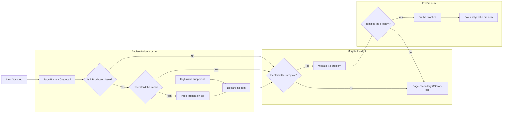


### Impact analysis 

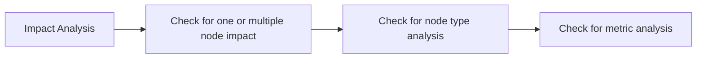

#### One vs multiple nodes 

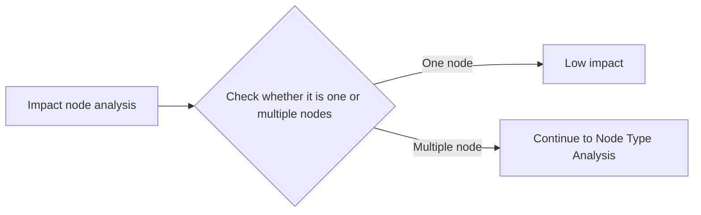

#### One vs multiple type of nodes 


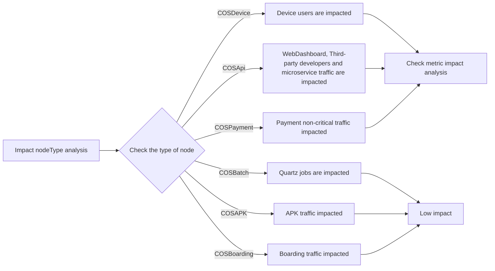

Metric Analysis


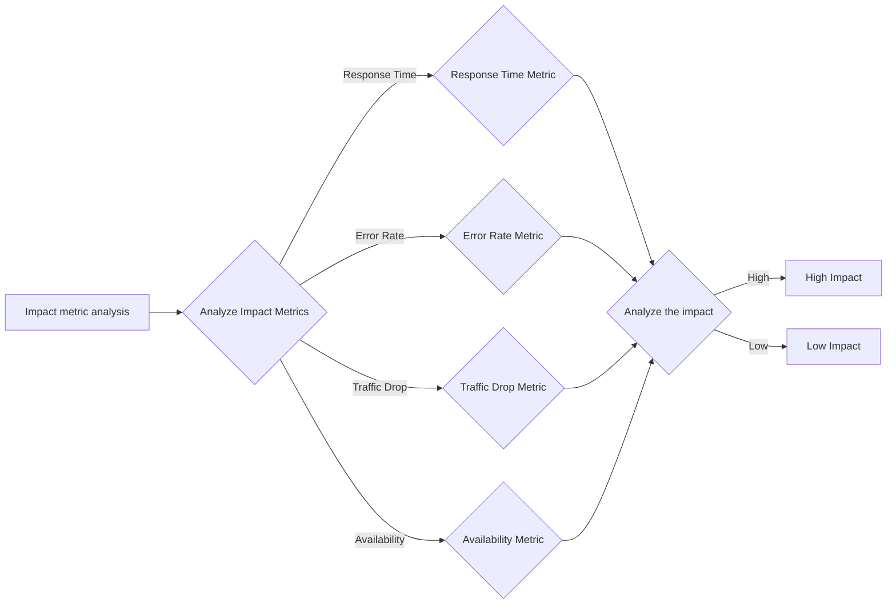
Declare the incident 

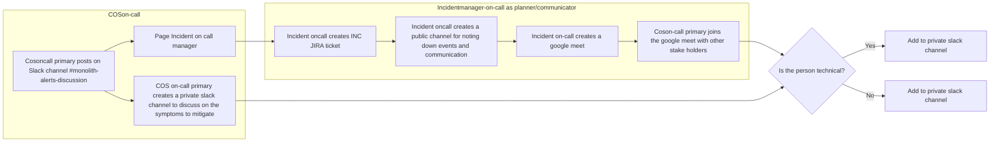

## Note the timeline 

#### Determine the timeline 

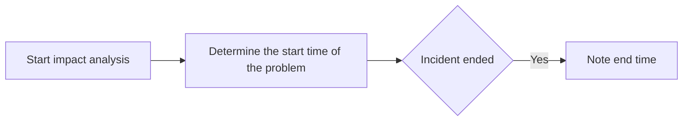

#### Issue occurred due to an internal change 

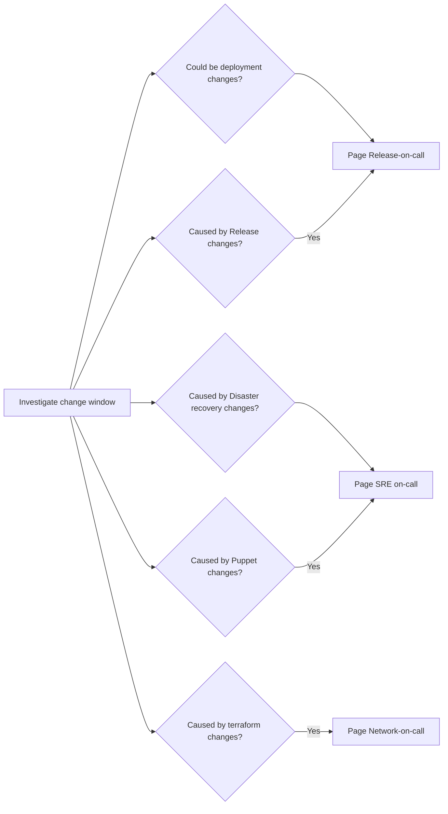

#### Issue occurred due to external factors 


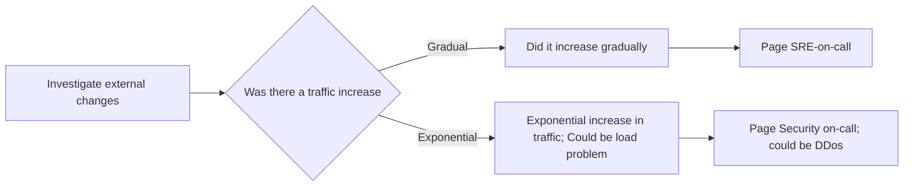


### Identify the problem 

#### Node out of rotation problem 


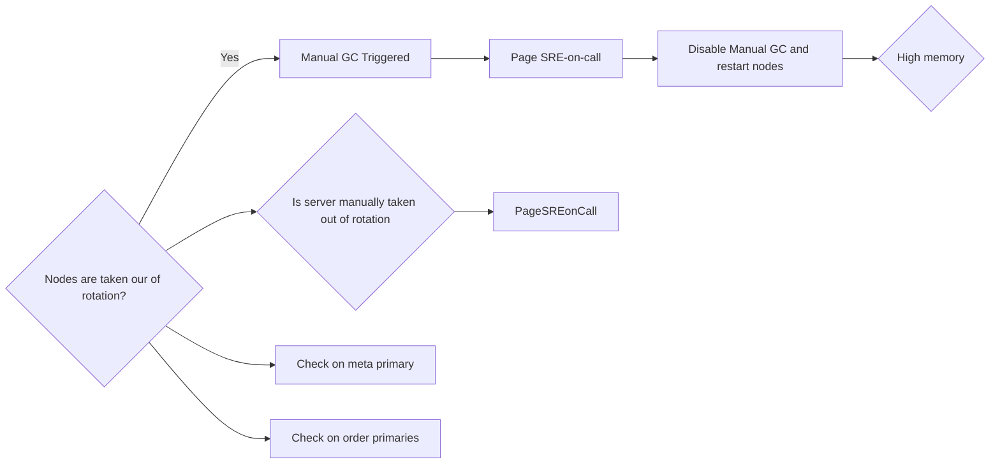

#### Load shedding problem 


#### High 5xx error rate


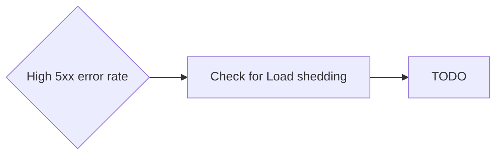


#### High 499 error rate 

```mermaid
flowchart LR
 
```

#### High memory problem 


```mermaid
flowchart LR
 
```


#### High thread problem 

```mermaid
flowchart LR
 
```


#### High disk utilization 

```mermaid
flowchart LR
 
```


#### High error in logs

```mermaid
flowchart LR

```

#### Meta primary database problem 

####  Meta Secondary database problem 

#### Order primary sharded database problem 

#### Order secondary sharded database problem 

#### Memcache problem 

#### Snowflake problem 

#### Kafka problem 

#### Pubsub problem 

#### Webdashboard problem 

#### Downstream service problem 

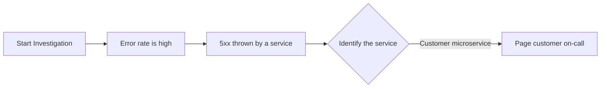

#### Upstream service problem 

### Collect evidences 
#### High memory evidences 

#### High thread evidences

### Mitigate the problem 

#### Memory mitigation 

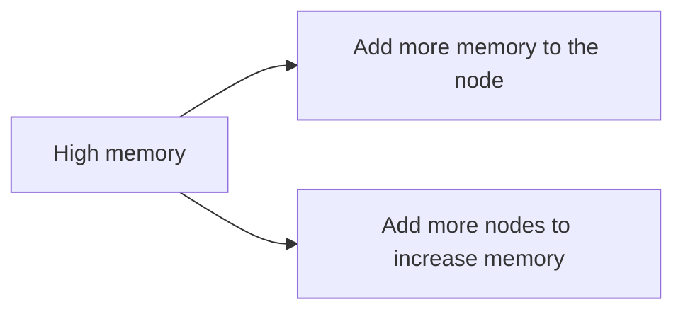

#### Thread mitigation 


#### Database mitigation 


#### Caffeine Cache mitigation 


#### Memcache mitigation 


#### Snowflake mitigation 


#### Kafka mitigation 


#### Pubsub mitigation 

downstream service mitigation 
#### Upstream service mitigation 

### Root cause analysis 


### Fix the problem 


#### Server feature turn off 

#### Setting turn off 

#### Hotfix deployment 


#### Rollback release 


### Post incident work 


--------

generate a mermaid diagram to identify all the 5xx errors.  Instead of A,B, I need proper names?  Please get deeper into how to investigate these errors in the diagram ?
> [!ai]+ AI Sonnet. Let me stick with it. 
>
> ```mermaid
> graph TD
> Start([Start]) --> IdentifyError[Identify Error Code]
> IdentifyError --> Is500Series{Is it a 5xx Error?}
> Is500Series -- No --> OtherErrors[Handle Other Errors]
> Is500Series -- Yes --> Server500Error[500 Internal Server Error]
> Server500Error --> CheckLogs[Check Application/Server Logs]
> CheckLogs --> IdentifyRootCause[Identify Root Cause]
> IdentifyRootCause --> FixIssue[Fix the Issue]
> FixIssue --> Redeploy[Redeploy Application]
> IdentifyRootCause --> EscalateIfNeeded[Escalate If Needed]
> Is500Series -- Yes --> BadGateway502Error[502 Bad Gateway Error]
> BadGateway502Error --> CheckProxy[Check Proxy/Load Balancer]
> CheckProxy --> RestartServices[Restart Services]
> RestartServices --> VerifyFix[Verify Fix]
> VerifyFix --> FixIssue
> Is500Series -- Yes --> ServiceUnavailable503Error[503 Service Unavailable Error]
> ServiceUnavailable503Error --> CheckCapacity[Check Server Capacity]
> CheckCapacity --> ScaleResources[Scale Resources]
> ScaleResources --> VerifyFix
> Is500Series -- Yes --> GatewayTimeout504Error[504 Gateway Timeout Error]
> GatewayTimeout504Error --> CheckDependencies[Check Downstream Dependencies]
> CheckDependencies --> RestartDependencies[Restart/Fix Dependencies]
> RestartDependencies --> VerifyFix
> Is500Series -- Yes --> HTTPVersionNotSupported505Error[505 HTTP Version Not Supported Error]
> HTTPVersionNotSupported505Error --> CheckConfiguration[Check Server Configuration]
> CheckConfiguration --> UpdateConfiguration[Update Server Configuration]
> UpdateConfiguration --> Redeploy
> FixIssue --> VerifyFix
> VerifyFix
 
> [!ai]+ AI Haiku - need to find the answer by asking multiple times 
>
> ```mermaid
> graph TD
> A(HTTP 500 Internal Server Error) --> B(Investigate server logs for error messages)
> B --> C(Identify the root cause of the error)
> C --> D(Determine the appropriate solution)
> D --> E(Implement the solution and test)
> E --> F(Monitor for recurrence of the issue)
> A(HTTP 500 Internal Server Error) --> G(HTTP 501 Not Implemented)
> G --> H(Ensure the requested functionality is implemented)
> H --> I(Update the server configuration or codebase as needed)
> I --> J(Verify the fix and test thoroughly)
> J --> F(Monitor for recurrence of the issue)
> A(HTTP 500 Internal Server Error) --> K(HTTP 502 Bad Gateway)
> K --> L(Investigate the proxy server or load balancer configuration)
> L --> M(Identify and address any issues with the upstream services)
> M --> N(Ensure the proxy server or load balancer is properly configured)
> N --> F(Monitor for recurrence of the issue)
> A(HTTP 500 Internal Server Error) --> O(HTTP 503 Service Unavailable)
> O --> P(Determine the cause of the service unavailability)
> P --> Q(Scale up resources or optimize the application as needed)
> Q --> R(Ensure the application can handle the expected load)
> R --> F(Monitor for recurrence of the issue)
> A(HTTP 500 Internal Server Error) --> S(HTTP 504 Gateway Timeout)
> S --> T(Investigate the timeout settings for the proxy server or load balancer)
> T --> U(Ensure the upstream services can respond within the configured timeout)
> U --> V(Adjust the timeout settings or optimize the application as needed)
> V --> F(Monitor for recurrence of the issue)
> ```
> The diagram identifies the different 5xx error codes that can occur, and provides a high-level process for resolving them. Here's a breakdown of the steps:
> 1. **HTTP 500 Internal Server Error**:
> - Investigate server logs for error messages to identify the root cause

> [!ai]+ AI Sonnet
>
> ```mermaid
> flowchart LR
> Start([Start]) --> A[Identify the 5xx error]
> A --> B{Is it a 500 Internal Server Error?}
> B -->|Yes| C[Check server logs and application logs for errors]
> C --> D[Identify the root cause and fix the issue]
> B -->|No| E{Is it a 501 Not Implemented Error?}
> E -->|Yes| F[Ensure the requested functionality is implemented]
> F --> D
> E -->|No| G{Is it a 502 Bad Gateway Error?}
> G -->|Yes| H[Check the upstream server or proxy]
> H --> I[Fix the issue with the upstream server or proxy]
> G -->|No| J{Is it a 503 Service Unavailable Error?}
> J -->|Yes| K[Check server load and resources]
> K --> L[Scale resources or implement load balancing]
> J -->|No| M{Is it a 504 Gateway Timeout Error?}
> M -->|Yes| N[Check upstream server response time]
> N --> O[Increase timeout or optimize upstream server]
> M -->|No| P{Is it a 505 HTTP Version Not Supported Error?}
> P -->|Yes| Q[Update server to support the required HTTP version]
> P -->|No| R[Other 5xx error]
> R --> S[Investigate and troubleshoot based on error code]
> D --> End([End])
> I --> End
> L --> End
> O --> End
> Q --> End
> S --> End
> ```
> This Mermaid diagram provides a visual representation of the steps involved in identifying and resolving various 5xx HTTP status codes. It starts by identifying the specific 5xx error code and branches out into different paths based on the error code. Each path provides guidance on troubleshooting and resolving the corresponding error.
> The diagram covers the following error codes:
> - 500 Internal Server Error
> - 501 Not Implemented Error
> - 502 Bad Gateway Error
> - 503 Service Unavailable Error
> - 504 Gateway
 
> [!ai]+ AI Claude 2.1
>
> Unfortunately I do not have enough context to generate a specific mermaid diagram for identifying 5xx errors. As an AI assistant without access to any systems or data, I would need more details about the environment, applications, logs, metrics, etc. to visualize the flow of identifying and troubleshooting errors.
> However, here is an example generic mermaid diagram that could be used as a starting point to visualize the process of handling 5xx errors:
> ```mermaid
> graph TD;
> User-->WebApp;
> WebApp-->200OK;
> WebApp-->5xxError;
> 5xxError-->Logging;
> 5xxError-->Alerting;
> Alerting-->PagerDuty;
> PagerDuty-->OnCallEngineer;
> OnCallEngineer-->Investigate;
> Investigate-->SourceCode;
> Investigate-->Metrics;
> Investigate-->Logs;
> OnCallEngineer-->Mitigate;
> OnCallEngineer-->PostMortem;
> ```
> This shows the high-level flow from a 5xx error being thrown, to logging/alerting, contacting the on-call engineer, investigation steps, mitigation, and follow-up with a post-mortem.
> To make this more specific, I would need more details on the specific systems, applications, error types, logs, metrics collection, alerting tools, etc. But hopefully this gives an idea of how a mermaid diagram can visualize the workflow for handling 5xx errors. Please let me know if you have any other questions!


------


## Key resources

### Establish timelines

1. When release occurred? [Release Schedules, Deployment Timelines & Status](https://confluence.corp.clover.com/pages/viewpage.action?pageId=92420453) 
2. When DR happened? 
    1. Warning: After a DR, you would notice spikes in metric. This is normal. You would need to observe before and after DR to establish whether there was gradual or spikes in the metrics. 

## COS Application

### Memory: High memory utilization > 70% 

1. Verification
    1. Grafana code: (host_jstat_heap_bytes{host=~"cos.*", dc="spl01", heap="old", service="Server"} * 100) / host_jstat_heap_max_bytes{host=~"cos.*", dc="spl01", heap="old", service="Server"}
    2. Grafana metric link: [https://clovernetwork.grafana.net/d/NNFA_2JVz/cos-monitoring?orgId=1&viewPanel=130&from=1707349143344&to=1707370743344](https://clovernetwork.grafana.net/d/NNFA_2JVz/cos-monitoring?orgId=1&viewPanel=130&from=1707349143344&to=1707370743344) 
2. Mitigation strategy: [https://confluence.corp.clover.com/display/ENG/%5BRunbook%5D+High+jvm+memory+in+COS+nodes#id-[Runbook]HighjvmmemoryinCOSnodes-RemediationSteps](https://confluence.corp.clover.com/display/ENG/%5BRunbook%5D+High+jvm+memory+in+COS+nodes#id-[Runbook]HighjvmmemoryinCOSnodes-RemediationSteps)

### Key resources

1. Understand node setup in different environment:  
    1. Tutorial on mdb:


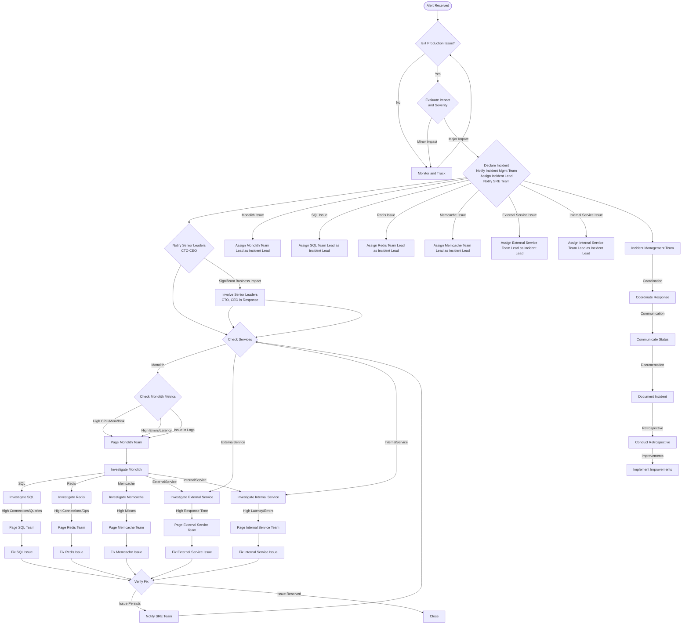