---
tags:
  - area/pal_employee_monolithobservability
  - date/2024-03-14
priority: P1
assignedTo: people/pal
work: analysis
---

Needs to be documented in [[Incident Management]]
[[Grafana queries]]

--------
## Alert Investigation 

- [ ] Alert occurred 
- [ ] Paged primary COS on-call 
- [ ] Is it production issue? 
	- [ ] Yes: impact understood? 
		- [ ] High: Declare the incident
		- [ ] Low: Continue investigation 
		- [ ] No: Page secondary COS on-call 
	- [ ] Post in #monolith-alerts-discussion channel 
- [ ] Symptom identified? 
	- [ ] Yes: Know a way to mitigate the problem? 
		- [ ] Yes: Problem mitigated 
		- [ ] No: Page secondary COS on-call 
	- [ ] No: Page secondary COS on-call 
- [ ] Problem identified? 
	- [ ] Yes: Know a way to fix the problem?  
		- [ ] Yes: Problem Fixed
		- [ ] No: Page secondary COS on-call 
	- [ ] No: Page secondary COS on-call 
- [ ] Post-analyze the problem 

## Impact Analysis 

### One vs multiple nodes 

- [ ] Check for one or multiple nodes 
	- [ ] Multiple node --> High 
	- [ ] One node --> Low 
- [ ] Identified impact? 
	- [ ] High: Move to verifying whether it is is one or multiple groups 
	- [ ] Low: Continue investigation with declaring incident 
### One vs multiple groups

- [ ] Impact groups? 
	- [ ] COSDevice: Device users are impacted -->  High
	- [ ] COSAPI: Webdashboard, Third-party developers, Microservice are impacted  --> High 
	- [ ] COSPayment: Payment non critical traffic are impacted --> High 
	- [ ] SupportServer: ??
	- [ ] COSBatch: Quartz job are impacted --> Low 
	- [ ] COSBoarding: Boarding traffic impacted --> Low 
	- [ ] COSAPK: APK traffic impacted --> Low 
- [ ] Identified impact? 
	- [ ] High: Move to metric analysis 
	- [ ] Low: Continue investigation with declaring incident 
### Metric analysis 

- [ ] Analyze the following metrics 
	- [ ] Response time metric i.e. latency 
	- [ ] Error rate metric 
	- [ ] Traffic drop metric 
	- [ ] Availability metric 
- [ ] Identified impact?
	- [ ] High: Declare the incident 
	- [ ] Low: Continue investigation with declaring incident 

## Declare the incident 

- [ ] Page Incident on-call manager 
- [ ]  Incident on-call manager 
	- [ ] Create INC JIRA ticket 
	- [ ] Create a public slack channel for noting down events and communication 
	- [ ] Create a google meet for mitigation efforts 
	- [ ] COS on-call joins the google meet 
- [ ] COS on-call 
	- [ ] Create a private slack channel to discuss the symptoms and fixes 
	- [ ] Let the leadership(Priya/Mohit/Vinayak) know about the channel to add engineers. 

## Determine the timeline 

- [ ] From the alert triggered, determine the start time of the incident 
- [ ] incident ended, determine the end time too. 

## Identify the symptom  

### Node out of rotation 
- [ ] Node taken out of rotation? 
	- [ ] Yes, Manual GC Triggered? 
	- [ ] Manually taken out of rotation 
	- [ ] Meta primary not serving traffic ?
	- [ ] Order primaries not serving traffic ? 


### Increase in traffic 

- [ ] Disaster Recovery cutover? 
	- [ ] Can be ignored as traffic increases when a passive region becomes active 
- [ ] Spike in traffic increase 
	- [ ] Could be DDoS ? Page Security on-call 
- [ ] Gradual increase in traffic 
	- [ ] Page SRE-on-call 

### High memory problem 
- [ ] Take a heap dump using rundeck job 
- [ ] Mitigation options
	- [ ] [Increase jvm memory]()
	- [ ] 

### High thread problem 
- [ ] Take a thread dump using rundeck job  
- [ ] Thread not revealing anything 
	- [ ] Enable thread dumps
- [ ] Mitigation options
	- [ ] [Disable server feature]() for non-critical features 
	- [ ] [Puppet config change]() to limit thread pool size
	- [ ] [Rolling restart the nodes]()

### High disk problem 
- [ ] 

### High 5xx error 

- [ ] Load shedding in event executor
- [ ] Load shedding in http executor
- [ ] Internal downstream service returning 5xx
	- [ ] Page team responsible for 5xx 
	- [ ] Mitigation options
		- [ ] [Disable server feature]() for non-critical features 
- [ ] External service returning 5xx 
	- [ ] Page team responsible for 5xx
	- [ ] Mitigation options
		- [ ] [Disable server feature]() for non-critical features 

### High 499 error rate 

- [ ] Increase in traffic ? 

### Database problem 
- [ ] Completely down 
- [ ] Connection issues 
- [ ] High CPU 
	- [ ] Full table scan in a table  
	- [ ] High number of scanned rows 
		- [ ] Handler 
			- [ ] [Disable the handler in HAProxy]() 
		- [ ] Batch job  [Grafana slowquery logs]() 
			- [ ] [Pause the batch job]() 
- [ ] Table missing 
	- [ ] [Rollback latest release]()
	- [ ] [Fix the schema problem]()

### Redis problem 
- [ ] Virtual node down 

### Memcache problem 
- [ ] Virtual node down 
- [ ] Virtual node partially down (Health check passing, not serving requests)

### Snowflake problem 

### Kafka problem 

### Pubsub problem 

### Web dashboard problem 

### Downstream service problem 

### Upstream service problem 


## Mitigate the problem 

#### Virtual node down 
- [ ] Page SRE-on-call
	- [ ] Create an Google priority P1 ticket 
	- [ ] Understand the impact of the node failure on users 

#### Rolling restart the application nodes 
- [ ] Via rundeck job [NA COSDevice]() [NA COSAPI]() [NA COSAPK]()
	- [ ] failure: Page SRE-on-call 

#### Take a node out of rotation 

#### Add additional application nodes  

#### Rollback to a previous version 

#### Rollback the DR process 

#### Block a specific handler request in HAProxy 

#### Turning off a server feature 

- [ ] Create an RM ticket 
- [ ] Page release on-call 
- [ ] Create a ticket for the respective team to find the root cause

#### Turning off a setting 

#### Puppet config change 

#### Revert a puppet change

#### Revert a terraform change 

#### Pause a batch job 

#### Restart the database nodes 

#### Add additional database nodes 

#### Restoring from backup 

#### Disabling network access to impacted nodes 

#### Enable settings in 

#### Turning webdashboard off 

## Root cause analysis 

### Application 


#### High 5xx error rate 
- [ ] No server feature. No mitigation. 
	- [ ] [[Hotfix deployment]] to add server feature 
- [ ] Server feature helped to mitigate 
	- [ ] [[Normal release]]
		- [ ] Internal service returning 5xx
			- [ ] Rate-limit request sent to external service 
			- [ ] Enable circuit breaking 
		- [ ] External service returning 5xx 
			- [ ] Rate-limit requests sent to external service 
			- [ ] Enable circuit breaking 

#### Increase in specific error log 
- [ ] Errors not impacting users 
	- [ ] Impact certain processing, change log level to WARN 
	- [ ] Only for informational purposes, change log level to INFO 
- [ ] Errors impacting users - Identify the specific root cause 

#### High thread count 
- [ ] Loadshed tasks by having a bounded queue 
- [ ] 

#### Threads dying 
- [ ] Due to exception 
	- [ ] Add exception blocks to catch failures that would lead to thread termination 
#### High number of rows read 
- [ ] Huge number of rows scanned 
	- [ ] [Shift the query to replica]() 
	- [ ] Batch job can batch the database requests 
- [ ] Full table scan 
	- [ ] In a select query --> Adding an index might help? [Grafana metric]()
	- [ ] In a subquery of insert/update --> Replace with join

#### Conflicts in writes 
- [ ] Unique key constraint violation 
	- [ ] Insert Ignore 
	- [ ] Upsert 
### Database 


## Fix the problem 

### Hotfix deployment 

### Normal release 


## Post incident work 

- [ ] Follow up tickets are created 
- [ ] 


--------


### Alert investigation

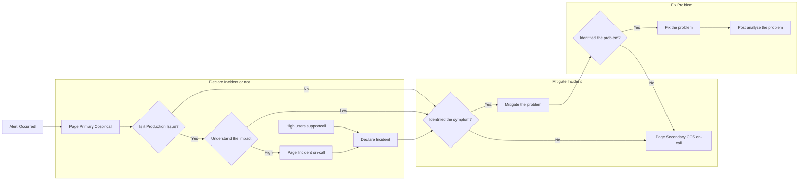


### Impact analysis 

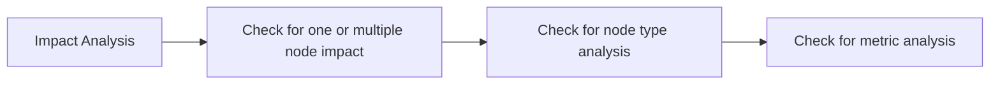

#### One vs multiple nodes 

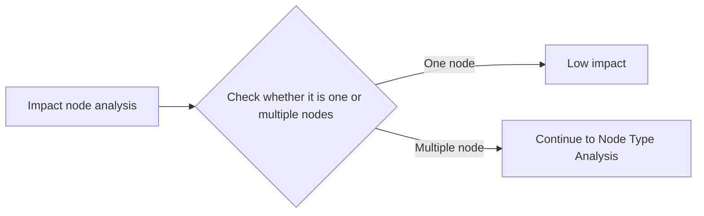

#### One vs multiple type of nodes 


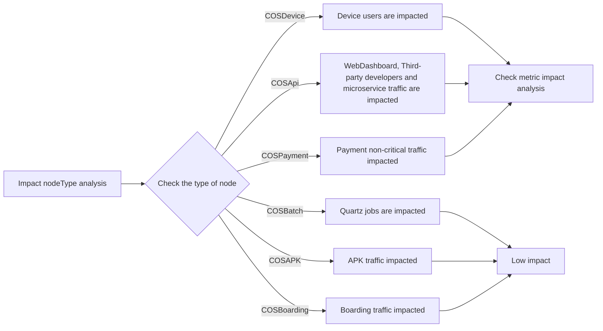

Metric Analysis


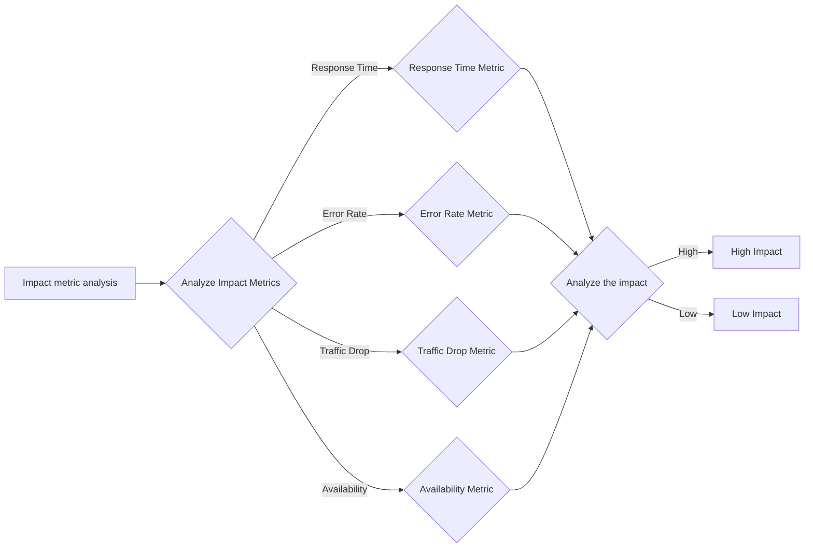
Declare the incident 

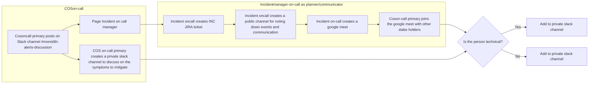

## Note the timeline 

#### Determine the timeline 

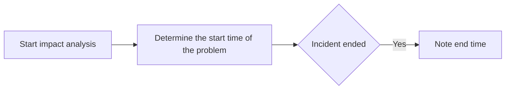

#### Issue occurred due to an internal change 

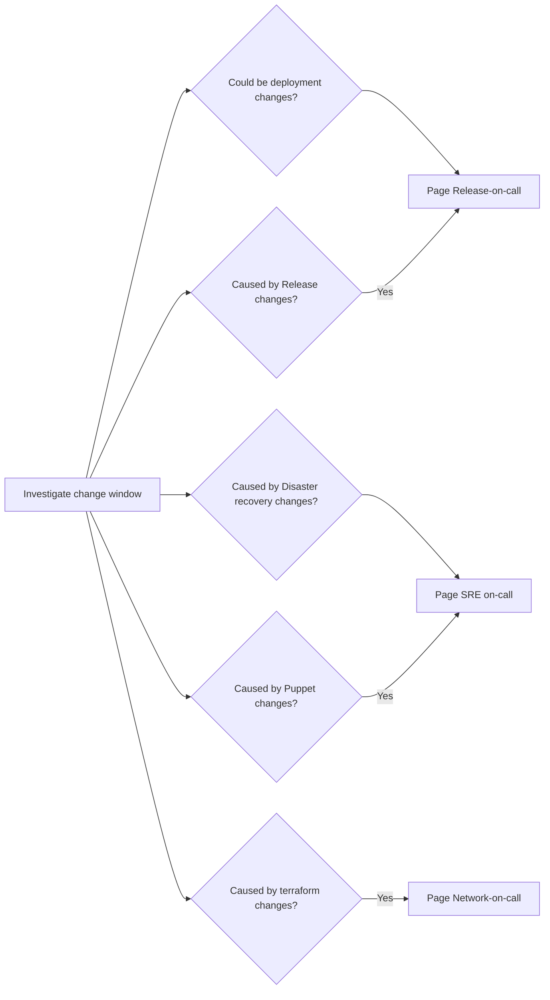

#### Issue occurred due to external factors 


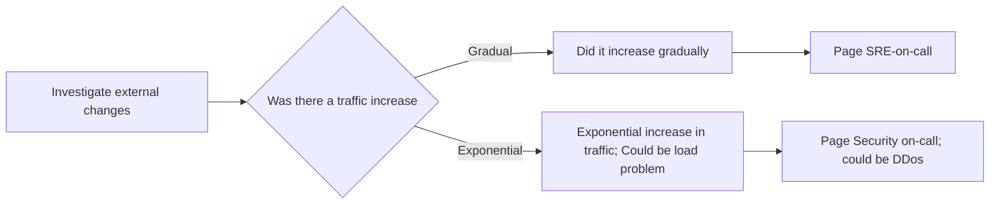


### Identify the problem 

#### Node out of rotation problem 


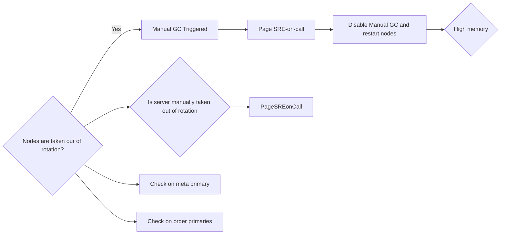

#### Load shedding problem 


#### High 5xx error rate


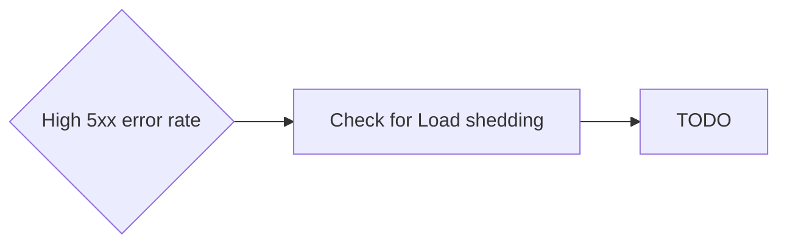


#### High 499 error rate 

```mermaid
flowchart LR
 
```

#### High memory problem 


```mermaid
flowchart LR
 
```


#### High thread problem 

```mermaid
flowchart LR
 
```


#### High disk utilization 

```mermaid
flowchart LR
 
```


#### High error in logs

```mermaid
flowchart LR

```

#### Meta primary database problem 

####  Meta Secondary database problem 

#### Order primary sharded database problem 

#### Order secondary sharded database problem 

#### Memcache problem 

#### Snowflake problem 

#### Kafka problem 

#### Pubsub problem 

#### Webdashboard problem 

#### Downstream service problem 

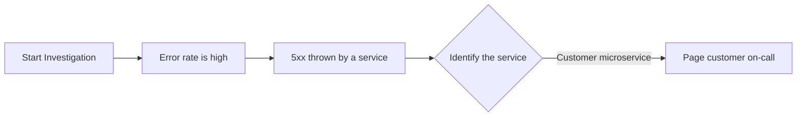

#### Upstream service problem 

### Collect evidences 
#### High memory evidences 

#### High thread evidences

### Mitigate the problem 

#### Memory mitigation 

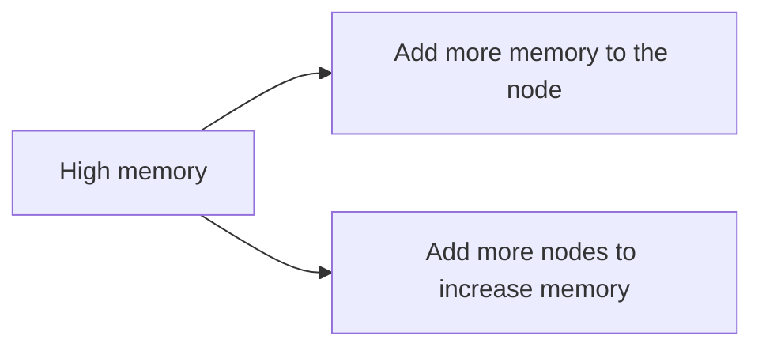

#### Thread mitigation 


#### Database mitigation 


#### Caffeine Cache mitigation 


#### Memcache mitigation 


#### Snowflake mitigation 


#### Kafka mitigation 


#### Pubsub mitigation 

downstream service mitigation 
#### Upstream service mitigation 

### Root cause analysis 


### Fix the problem 


#### Server feature turn off 

#### Setting turn off 

#### Hotfix deployment 


#### Rollback release 


### Post incident work 


--------

generate a mermaid diagram to identify all the 5xx errors.  Instead of A,B, I need proper names?  Please get deeper into how to investigate these errors in the diagram ?
> [!ai]+ AI Sonnet. Let me stick with it. 
>
> ```mermaid
> graph TD
> Start([Start]) --> IdentifyError[Identify Error Code]
> IdentifyError --> Is500Series{Is it a 5xx Error?}
> Is500Series -- No --> OtherErrors[Handle Other Errors]
> Is500Series -- Yes --> Server500Error[500 Internal Server Error]
> Server500Error --> CheckLogs[Check Application/Server Logs]
> CheckLogs --> IdentifyRootCause[Identify Root Cause]
> IdentifyRootCause --> FixIssue[Fix the Issue]
> FixIssue --> Redeploy[Redeploy Application]
> IdentifyRootCause --> EscalateIfNeeded[Escalate If Needed]
> Is500Series -- Yes --> BadGateway502Error[502 Bad Gateway Error]
> BadGateway502Error --> CheckProxy[Check Proxy/Load Balancer]
> CheckProxy --> RestartServices[Restart Services]
> RestartServices --> VerifyFix[Verify Fix]
> VerifyFix --> FixIssue
> Is500Series -- Yes --> ServiceUnavailable503Error[503 Service Unavailable Error]
> ServiceUnavailable503Error --> CheckCapacity[Check Server Capacity]
> CheckCapacity --> ScaleResources[Scale Resources]
> ScaleResources --> VerifyFix
> Is500Series -- Yes --> GatewayTimeout504Error[504 Gateway Timeout Error]
> GatewayTimeout504Error --> CheckDependencies[Check Downstream Dependencies]
> CheckDependencies --> RestartDependencies[Restart/Fix Dependencies]
> RestartDependencies --> VerifyFix
> Is500Series -- Yes --> HTTPVersionNotSupported505Error[505 HTTP Version Not Supported Error]
> HTTPVersionNotSupported505Error --> CheckConfiguration[Check Server Configuration]
> CheckConfiguration --> UpdateConfiguration[Update Server Configuration]
> UpdateConfiguration --> Redeploy
> FixIssue --> VerifyFix
> VerifyFix
 
> [!ai]+ AI Haiku - need to find the answer by asking multiple times 
>
> ```mermaid
> graph TD
> A(HTTP 500 Internal Server Error) --> B(Investigate server logs for error messages)
> B --> C(Identify the root cause of the error)
> C --> D(Determine the appropriate solution)
> D --> E(Implement the solution and test)
> E --> F(Monitor for recurrence of the issue)
> A(HTTP 500 Internal Server Error) --> G(HTTP 501 Not Implemented)
> G --> H(Ensure the requested functionality is implemented)
> H --> I(Update the server configuration or codebase as needed)
> I --> J(Verify the fix and test thoroughly)
> J --> F(Monitor for recurrence of the issue)
> A(HTTP 500 Internal Server Error) --> K(HTTP 502 Bad Gateway)
> K --> L(Investigate the proxy server or load balancer configuration)
> L --> M(Identify and address any issues with the upstream services)
> M --> N(Ensure the proxy server or load balancer is properly configured)
> N --> F(Monitor for recurrence of the issue)
> A(HTTP 500 Internal Server Error) --> O(HTTP 503 Service Unavailable)
> O --> P(Determine the cause of the service unavailability)
> P --> Q(Scale up resources or optimize the application as needed)
> Q --> R(Ensure the application can handle the expected load)
> R --> F(Monitor for recurrence of the issue)
> A(HTTP 500 Internal Server Error) --> S(HTTP 504 Gateway Timeout)
> S --> T(Investigate the timeout settings for the proxy server or load balancer)
> T --> U(Ensure the upstream services can respond within the configured timeout)
> U --> V(Adjust the timeout settings or optimize the application as needed)
> V --> F(Monitor for recurrence of the issue)
> ```
> The diagram identifies the different 5xx error codes that can occur, and provides a high-level process for resolving them. Here's a breakdown of the steps:
> 1. **HTTP 500 Internal Server Error**:
> - Investigate server logs for error messages to identify the root cause

> [!ai]+ AI Sonnet
>
> ```mermaid
> flowchart LR
> Start([Start]) --> A[Identify the 5xx error]
> A --> B{Is it a 500 Internal Server Error?}
> B -->|Yes| C[Check server logs and application logs for errors]
> C --> D[Identify the root cause and fix the issue]
> B -->|No| E{Is it a 501 Not Implemented Error?}
> E -->|Yes| F[Ensure the requested functionality is implemented]
> F --> D
> E -->|No| G{Is it a 502 Bad Gateway Error?}
> G -->|Yes| H[Check the upstream server or proxy]
> H --> I[Fix the issue with the upstream server or proxy]
> G -->|No| J{Is it a 503 Service Unavailable Error?}
> J -->|Yes| K[Check server load and resources]
> K --> L[Scale resources or implement load balancing]
> J -->|No| M{Is it a 504 Gateway Timeout Error?}
> M -->|Yes| N[Check upstream server response time]
> N --> O[Increase timeout or optimize upstream server]
> M -->|No| P{Is it a 505 HTTP Version Not Supported Error?}
> P -->|Yes| Q[Update server to support the required HTTP version]
> P -->|No| R[Other 5xx error]
> R --> S[Investigate and troubleshoot based on error code]
> D --> End([End])
> I --> End
> L --> End
> O --> End
> Q --> End
> S --> End
> ```
> This Mermaid diagram provides a visual representation of the steps involved in identifying and resolving various 5xx HTTP status codes. It starts by identifying the specific 5xx error code and branches out into different paths based on the error code. Each path provides guidance on troubleshooting and resolving the corresponding error.
> The diagram covers the following error codes:
> - 500 Internal Server Error
> - 501 Not Implemented Error
> - 502 Bad Gateway Error
> - 503 Service Unavailable Error
> - 504 Gateway
 
> [!ai]+ AI Claude 2.1
>
> Unfortunately I do not have enough context to generate a specific mermaid diagram for identifying 5xx errors. As an AI assistant without access to any systems or data, I would need more details about the environment, applications, logs, metrics, etc. to visualize the flow of identifying and troubleshooting errors.
> However, here is an example generic mermaid diagram that could be used as a starting point to visualize the process of handling 5xx errors:
> ```mermaid
> graph TD;
> User-->WebApp;
> WebApp-->200OK;
> WebApp-->5xxError;
> 5xxError-->Logging;
> 5xxError-->Alerting;
> Alerting-->PagerDuty;
> PagerDuty-->OnCallEngineer;
> OnCallEngineer-->Investigate;
> Investigate-->SourceCode;
> Investigate-->Metrics;
> Investigate-->Logs;
> OnCallEngineer-->Mitigate;
> OnCallEngineer-->PostMortem;
> ```
> This shows the high-level flow from a 5xx error being thrown, to logging/alerting, contacting the on-call engineer, investigation steps, mitigation, and follow-up with a post-mortem.
> To make this more specific, I would need more details on the specific systems, applications, error types, logs, metrics collection, alerting tools, etc. But hopefully this gives an idea of how a mermaid diagram can visualize the workflow for handling 5xx errors. Please let me know if you have any other questions!


------


## Key resources

### Establish timelines

1. When release occurred? [Release Schedules, Deployment Timelines & Status](https://confluence.corp.clover.com/pages/viewpage.action?pageId=92420453) 
2. When DR happened? 
    1. Warning: After a DR, you would notice spikes in metric. This is normal. You would need to observe before and after DR to establish whether there was gradual or spikes in the metrics. 

## COS Application

### Memory: High memory utilization > 70% 

1. Verification
    1. Grafana code: (host_jstat_heap_bytes{host=~"cos.*", dc="spl01", heap="old", service="Server"} * 100) / host_jstat_heap_max_bytes{host=~"cos.*", dc="spl01", heap="old", service="Server"}
    2. Grafana metric link: [https://clovernetwork.grafana.net/d/NNFA_2JVz/cos-monitoring?orgId=1&viewPanel=130&from=1707349143344&to=1707370743344](https://clovernetwork.grafana.net/d/NNFA_2JVz/cos-monitoring?orgId=1&viewPanel=130&from=1707349143344&to=1707370743344) 
2. Mitigation strategy: [https://confluence.corp.clover.com/display/ENG/%5BRunbook%5D+High+jvm+memory+in+COS+nodes#id-[Runbook]HighjvmmemoryinCOSnodes-RemediationSteps](https://confluence.corp.clover.com/display/ENG/%5BRunbook%5D+High+jvm+memory+in+COS+nodes#id-[Runbook]HighjvmmemoryinCOSnodes-RemediationSteps)

### Key resources

1. Understand node setup in different environment:  
    1. Tutorial on mdb:


