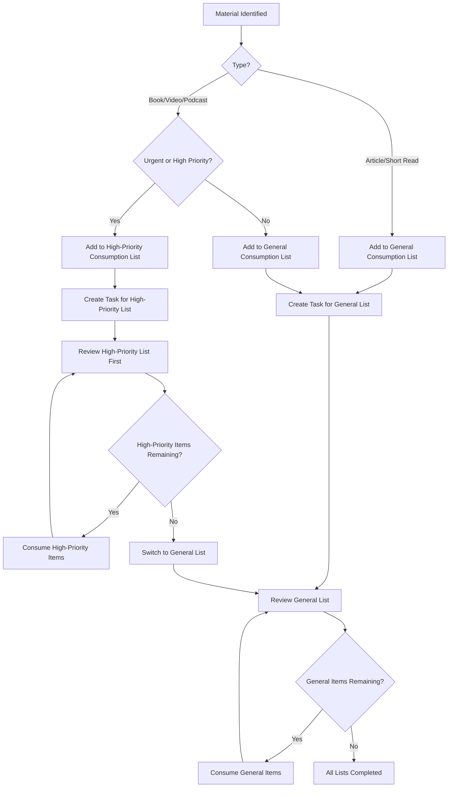

```mermaid
flowchart TD
    A[Material Identified] --> B{Type?}
    B -->|Article/Short Read| C[Add to General Consumption List]
    B -->|Book/Video/Podcast| D{Urgent or High Priority?}
    D -->|Yes| E[Add to High-Priority Consumption List]
    D -->|No| F[Add to General Consumption List]
    E --> G[Create Task for High-Priority List]
    C --> H[Create Task for General List]
    F --> H
    G --> I[Review High-Priority List First]
    H --> J[Review General List]
    I --> K{High-Priority Items Remaining?}
    K -->|Yes| L[Consume High-Priority Items]
    K -->|No| M[Switch to General List]
    J --> N{General Items Remaining?}
    N -->|Yes| O[Consume General Items]
    N -->|No| P[All Lists Completed]
    M --> J
    L --> I
    O --> J
```