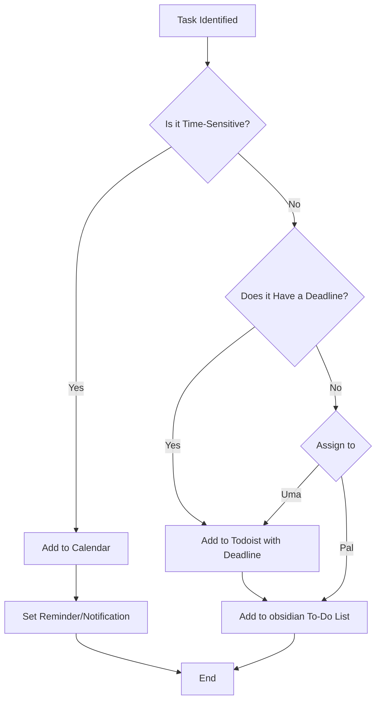
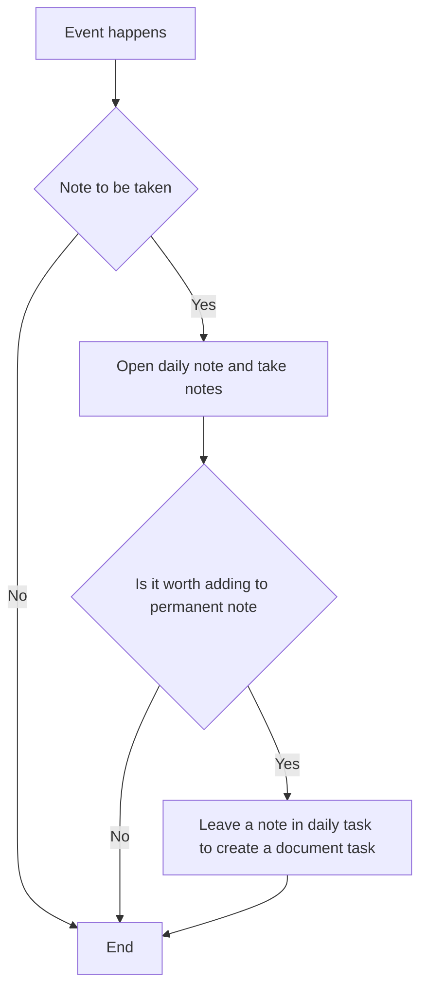
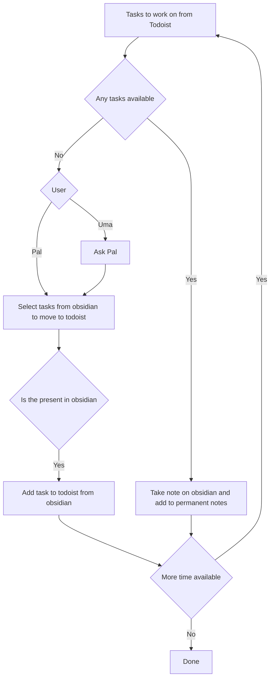

#### Task addition 

```mermaid
flowchart TD
    A[Task Identified] --> B{Is it Time-Sensitive?}
    B -->|Yes| C[Add to Calendar]
    B -->|No| D{Does it Have a Deadline?}
    D -->|Yes| E[Add to Todoist with Deadline]
    E --> F[Add to obsidian To-Do List]
    D -->|No| I{Assign to}
    I -->|Uma|E
    I -->|Pal|F
    C --> G[Set Reminder/Notification]
    G --> J[End]
    F --> J
```
#### Google calendar consumption 

```mermaid
flowchart TD
    A[Event happens] --> B{Note to be taken}
    B --> |Yes| C[Open daily note and take notes]
    C --> E{Is it worth adding to permanent note}
    E --> |Yes| F[Leave a note in daily task to create a document task]
    B --> |No| G[End]
    E --> |No| G
    F --> G
```

#### Todoist task consumption 

```mermaid
flowchart TD
    A[Tasks to work on from Todoist] --> B{Any tasks available}
    B --> |Yes| C[Take note on obsidian and add to permanent notes]
    B --> |No| D{User}
    D --> |Uma| E[Ask Pal]
    D --> |Pal| F[Select tasks from obsidian to move to todoist]
    E --> F 
    F --> H{Is the present in obsidian} 
    H --> |Yes| G[Add task to todoist from obsidian]
    G --> J{More time available}
    J --> |Yes| A
    J --> |No| I[Done]
    C --> J
```

